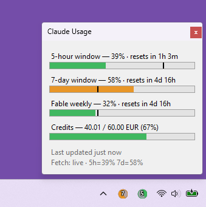

<div align="center">

# Claude Usage Tray

**Your Claude limits, always visible — right next to the clock.**

A tiny Windows tray app that shows your **5-hour** and **7-day** usage as filled badge
icons, plus per-model weekly caps and paid credit spend at a glance.

[](https://github.com/wus-technik/win_systray-claude-usage/releases/latest)
[](https://github.com/wus-technik/win_systray-claude-usage/actions/workflows/ci.yml)
[](https://github.com/wus-technik/win_systray-claude-usage/releases)

[](LICENSE)


<br>



<sub>Left-click the tray icon for the full picture. Every bar is colour-coded by severity, and the
marker line shows where the clock is: fill short of it means you're burning slower than the clock.</sub>

</div>

---

## Why

Claude Code tells you that you hit a limit *after* you hit it. This sits in your tray and
tells you it's coming — the rolling windows, the per-model weekly cap that throttles first,
and how much paid credit you've burned this month.

## What you get

| | |
|---|---|
| 📊 **Two badge icons** | Fill = usage, colour = severity, centre digit = window (`5` or `7`) |
| 🎯 **Per-model caps** | Weekly limits scoped to a model (e.g. Fable) or surface — the cap that usually bites first |
| 💳 **Credit spend** | Paid extra-usage against your limit, in **your** account's currency |
| ⏱️ **Reset countdowns** | "resets in 3h 58m", on hover and in the popup |
| 📈 **Pace marker** | A line on each bar marking where the *clock* is in the period — fill past it means you're on track to hit the cap early |
| 🚦 **Pace colours** | Colour follows usage *against the clock*, not raw percent: 60 % with 5½ of 7 days gone stays green, 40 % in the first hour of a 5-hour window goes red |
| 🔄 **Live + offline** | Polls Anthropic's usage API every 5 min; falls back to Claude Code's local cache |
| 🚨 **Platform status** | Claude's own service banner — while status.claude.com says anything but "All Systems Operational", a white warning badge sits on every tray icon and the popup lists the active incidents |
| 🚀 **Zero-friction** | Per-user install, no admin, auto-updates, starts at login |

## Install

Download **[`ClaudeUsageTraySetup.exe`](https://github.com/wus-technik/win_systray-claude-usage/releases/download/setup-stub/ClaudeUsageTraySetup.exe)**
and run it. The link never changes: the small launcher fetches the newest release for the ring you
pick — **Stable** or **Beta** — and hands off to that release's installer. Run it again later to
move an existing install between the two rings.

> [!NOTE]
> Per-user install — no admin rights, nothing written outside your profile. Updates apply
> themselves in the background; the tray menu offers **Restart to update** when one is staged.
> Prefer no installer? A portable `.zip` ships with every release, as does the classic
> `WusTechnik.ClaudeUsageTray-win-Setup.exe`.

<details>
<summary><b>Unattended deployment</b></summary>

<br>

```
ClaudeUsageTraySetup.exe --ring stable|beta --silent [--token <t>]
```

The launcher is a windowed program, so a plain shell call returns immediately with no exit code;
from a script wait for it explicitly — `Start-Process ClaudeUsageTraySetup.exe -ArgumentList
'--silent','--ring','stable' -Wait -PassThru` in PowerShell (`.ExitCode` carries the result),
`start /wait ClaudeUsageTraySetup.exe --silent --ring stable` in cmd. Intune, SCCM and
PSAppDeployToolkit already wait on the process handle.

Always pass `--ring`: with `--silent` and no ring on a machine that already has the app, the
launcher changes nothing and exits `3004`, because a default would silently drag a deliberate beta
opt-in back to stable. Running it repeatedly with the same `--ring` is idempotent and exits `0`.

It must run **in the user's session**, not as SYSTEM (Intune Win32 apps and SCCM programs default
to SYSTEM). From that context a per-user install lands in the SYSTEM profile and is useless, so the
launcher refuses with `3001`. For detection rules, check for
`%LOCALAPPDATA%\WusTechnik.ClaudeUsageTray\current\ClaudeUsageTray.exe` or the Velopack uninstall key
under `HKCU\Software\Microsoft\Windows\CurrentVersion\Uninstall`.

`--ring beta` looks up GitHub's release list, which is rate-limited per source IP (60/h
unauthenticated, shared behind a NAT). A fleet rollout should pass `--token` (or set `GH_TOKEN`) or
roll out stable and let users tick **Use beta releases** in the app. Without the API the beta path
fails closed in silent mode rather than installing stable content behind an operator's back.

Switching the ring of an installed app stops and restarts it and writes `useBetaReleases`; the move
itself completes when the user accepts **Restart to update** — the launcher never applies packages.

| Exit code | Meaning |
|---|---|
| `0` | Installed, ring changed, or already correct |
| *other* | `Setup.exe` ran and returned this code |
| `3001` | Bad arguments, or SYSTEM / session-0 context |
| `3002` | No release found for the ring (or API unavailable in silent mode) |
| `3003` | Download failed, or the file was empty, not an executable, or failed its digest check |
| `3004` | `--silent` without `--ring` on an existing install |
| `3005` | Could not stop or restart the app, could not start Setup.exe, or the settings write did not persist |
| `3006` | Cancelled |

Diagnostics land in `%APPDATA%\ClaudeUsageTray\setup.log`. `ClaudeUsageTraySetup.exe --version`
prints the launcher's own version and build commit.

</details>

## Using it

### The icons

| What you see | What it means |
|---|---|
| 🟢 Green badge | On or under the pace the clock sets for the period |
| 🟠 Orange badge | Burning ≥ 1.1× the clock — the cap arrives before the reset |
| 🔴 Red badge | Burning ≥ 1.75× the clock, **or** over 85 % used whatever the pace |
| Dimmed | Stale data (Claude Code data older than 15 min, or Claude Desktop history older than 3 h) |
| Grey `—` | No data yet — open Claude Code or Claude Desktop once |

The pace ratio is `percent used ÷ percent of the period elapsed` — the same comparison the marker
line makes visually. When it is what decided the colour, the popup caption and the hover tooltip name
it (`· 1.4× pace`). Two guards override it: below 20 % used, or in the first 10 % of a period, a huge
ratio over a trivial number means nothing and the plain `thresholds` percentages decide instead; and
past `thresholds.red` the badge is red however calm the pace, because running out is running out.
Without a trustworthy reset time the plain percentages decide too. Set `paceColors` to `false` for the
old percent-only behaviour.

### Interactions

- **Hover** → exact percentage and reset countdown
- **Left-click** → the popup above: both windows, any scoped weekly caps, credit spend
- **Right-click** → `Settings…`, `Refresh now`, `Restart to update`, `Quit`

<details>
<summary><b>How the popup decides what to show</b></summary>

<br>

Rows appear only when the data behind them exists. Nothing is ever rendered as a
placeholder `0 %` or `—` for a limit you don't have:

- **Scoped weekly rows** are read from the payload's `limits[]` array and **labelled from the
  payload itself**, so a renamed or newly added model shows up with no app update. On a plan
  without per-model caps, there's simply no entry — and therefore no row.
- **Currently-binding limits sort first** and are never hidden, even when several caps exist.
  Background limits are capped at four rows with a `+N more` line, so the popup can't grow
  off-screen.
- **Credits** are shown with your account's own ISO currency code and decimal precision —
  never an assumed `$`. Their bar follows the server's own severity, because "spend cap
  reached" is state a percentage can't express. `disabled` and `limit reached` get their own
  line rather than being hidden.

</details>

<details>
<summary><b>Where the data comes from</b></summary>

<br>

Three usage sources plus the status page. Claude Code's data wins whenever it is current; the
Claude Desktop history steps in when it is not.

1. **Live** — read-only `GET` against Anthropic's OAuth usage endpoint every 5 minutes,
   the same source claude.ai uses, authenticated with **Claude Code's existing token**.
   The app never stores, refreshes, or logs that token, and respects `Retry-After` on 429s.
2. **Offline fallback** — the `cachedUsageUtilization` block Claude Code writes to
   `%USERPROFILE%\.claude.json`, used whenever no valid token is available.
3. **Claude Desktop history** — `plan-usage-history.json`, which the Claude Desktop app keeps in
   `%APPDATA%\Claude\` or, on newer versions, inside its package container under
   `%LOCALAPPDATA%\Packages\Claude_*\LocalCache\Roaming\Claude\`. Both places are checked and the
   newer file wins. It is used only when the two Claude Code sources are absent or stale, and it
   carries percentages only: no reset times (so no countdowns, no pace colouring, no time marker),
   no per-model limits, no credit amounts. The desktop app writes it only while you work in it, so
   gaps of an hour are normal; it counts as stale after `desktopStalenessHours`. If you only use
   Claude Desktop, this is where your numbers come from. The field meanings are inferred from
   observation, not documented, so a desktop app update can silently change them.
   On a machine that has both apps but no usable Claude Code credentials, the display switches to
   this source whenever Claude Code's cache goes stale, so the countdowns, time marker and pace
   colouring can come and go; `fetch.log` records each switch.
4. **Platform status** — the public status page at status.claude.com, polled once a minute with
   no auth and no token involved. The page's own banner decides the warning badge; incident
   details are the page's own words.

When nothing yields data, the popup says which of these is missing — `.claude.json` absent, present
without a usage block, no credentials file for the live fetch, or a desktop history file with no
samples — instead of a blanket "run Claude Code". Note that installing Claude Desktop also installs
Claude Code, so `.claude.json` usually exists even on a machine that never ran the CLI directly.

A rolling diagnostic log lands in `%APPDATA%\ClaudeUsageTray\fetch.log` so a
"stale, never refreshes" report is debuggable. It records fetch outcomes and the two window
percentages only — **never** money amounts, currency, or account-specific model names.

</details>

## Settings

**Right-click → `Settings…`** covers everything except the two path overrides: which icons to show,
run-at-startup, the two colour thresholds, pace colouring, and the two staleness cutoffs. Saving applies
at once — the badges and the popup repaint, no restart. A preview bar shows where the thresholds land
before you commit them, and the two spinners constrain each other so `orange` can never reach `red`.

Its **About** section names the running version and splits updating into the two decisions it
actually is. The **⟳** button checks GitHub Releases straight away rather than waiting for the
six-hourly background check, and reports what it found — `0.7.1 ready to install`, `up to date`, or
`check failed`. **Update now** stays disabled until a check has staged something, then shows that
version's changelog with *Update and restart* or *Later*, so you can read what changes before
committing to the restart. Any edits still open in the dialog are saved first, and a failed save
cancels the restart rather than losing them. Updates published before 0.7.1 carry no changelog and
fall back to a plain confirmation. Outside the installed app there is nothing to update, so both
controls are disabled.

**Use beta releases** in the same section picks which builds the updater considers. Off — the default
for a normal install — only stable releases are ever offered. On, pre-release builds
(`0.7.2-beta.1`, `0.7.2-beta.2`, …) are offered as well, and stable releases still arrive, so opting
in never means falling behind. Changing it applies to the next check, with no restart; unchecking it
moves you back to the latest stable build, even when that means stepping down from a newer beta.

Installing from the beta installer starts the box ticked, since that is plainly what was asked for —
until you tick or untick it yourself, the app follows the channel it was installed from.

Everything is also readable and editable in `%APPDATA%\ClaudeUsageTray\settings.json`. An invalid
value there falls back to its default on load — the pair `orange`/`red` resets together, since the
file gives no way to tell which of the two was meant.

| Key | Meaning | Default |
|---|---|---|
| `displayMode` | `"fiveHour"` \| `"sevenDay"` \| `"both"` | `"both"` |
| `thresholds` | `{ "orange": 50, "red": 85 }` severity boundaries (%) — with `paceColors` on, the red value is the absolute ceiling and both are the fallback | as shown |
| `paceColors` | colour by usage against elapsed time instead of raw percent | `true` |
| `stalenessMinutes` | minutes before data is flagged stale | `15` |
| `desktopStalenessHours` | hours before Claude Desktop history data is flagged stale | `3` |
| `runAtStartup` | applied to the HKCU `Run` key at every installed launch | `true` |
| `useBetaReleases` | offer pre-release builds too; `false` means stable releases only | unset — follows the channel the app was installed from |
| `configPathOverride` | explicit path to `.claude.json` (mainly for tests); file-only, and re-read at launch | unset |
| `desktopHistoryPathOverride` | explicit path to the desktop app's `plan-usage-history.json`; file-only, and re-read at launch | unset |

## Privacy

The app sends no telemetry and has no install or machine identifier. Its only network traffic is
the Claude usage API, the Claude status page, and the Velopack update feed on GitHub Releases.

The project's only usage metric is GitHub's public download counter on release assets. A
scheduled workflow snapshots those counters once a day into the `stats` branch, which adds a
history of aggregate public numbers and nothing about any user or machine. See
`docs/download-stats.md` for what the numbers mean.

## Development

```powershell
dotnet test                              # unit tests (all core logic)
dotnet run --project src/ClaudeUsageTray # run the tray app
.\build\build-release.ps1                # publish + vpk pack → .\Releases
```

Parsing, formatting, severity, and row-selection logic all live in `Core/` as pure functions
so they're testable without WinForms; `Tray/` only draws. Production releases are published
by the tag-triggered GitHub Actions workflow — push a `v*` tag whose version matches
`<Version>` in the csproj and it validates, tests, packs, and publishes.

<details>
<summary><b>Design docs</b></summary>

<br>

| Document | Covers |
|---|---|
| [`spec/claude-usage-tray.md`](docs/superpowers/spec/claude-usage-tray.md) | The original app specification |
| [`specs/2026-07-24-live-usage-fetch-design.md`](docs/superpowers/specs/2026-07-24-live-usage-fetch-design.md) | Live API polling and rate-limit handling |
| [`specs/2026-07-24-icon-readability-design.md`](docs/superpowers/specs/2026-07-24-icon-readability-design.md) | Badge icon legibility at tray size |
| [`specs/2026-07-27-fable-and-credits-design.md`](docs/superpowers/specs/2026-07-27-fable-and-credits-design.md) | Scoped weekly limits and credit usage |
| [`specs/2026-08-26-platform-status-design.md`](docs/superpowers/specs/2026-08-26-platform-status-design.md) | Platform status polling and the taskbar outage indicator |
| [`specs/2026-09-04-beta-release-ring-design.md`](docs/superpowers/specs/2026-09-04-beta-release-ring-design.md) | The stable/beta release rings and the return-to-stable downgrade |
| [`specs/2026-09-04-setup-stub-design.md`](docs/superpowers/specs/2026-09-04-setup-stub-design.md) | The version-independent setup launcher and ring switching |

</details>

---

## License

[MIT](LICENSE) © 2026 W&S Technik GmbH

<div align="center">
<sub>Not affiliated with Anthropic. Reads only your own local Claude Code credentials and usage data.</sub>
</div>
